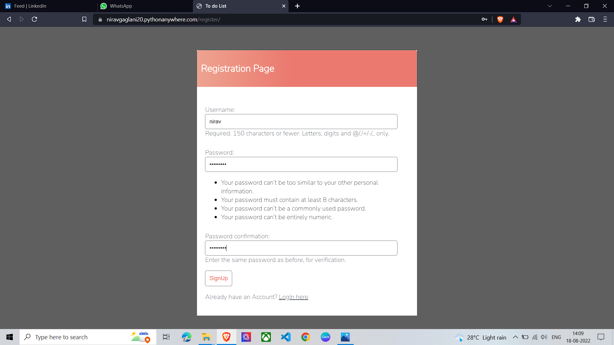
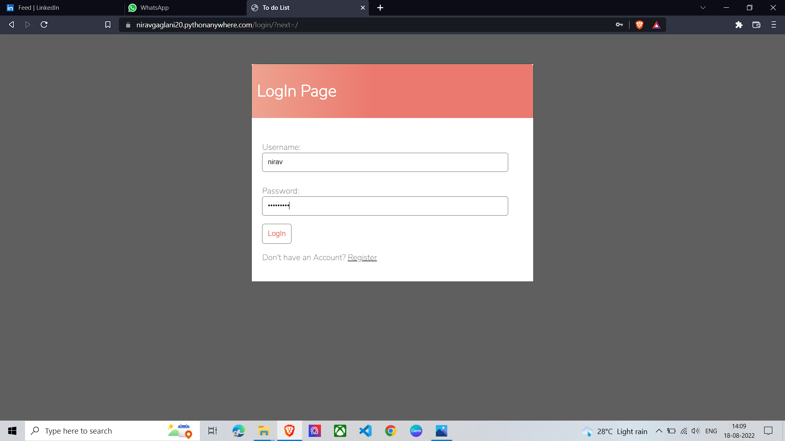
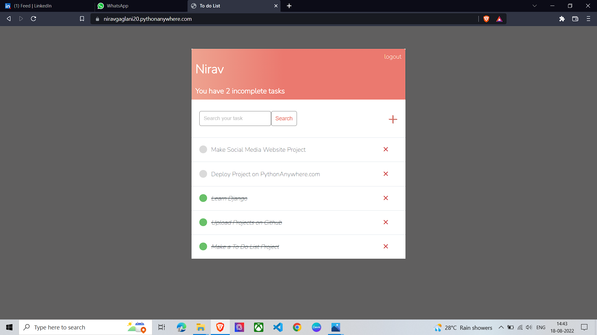
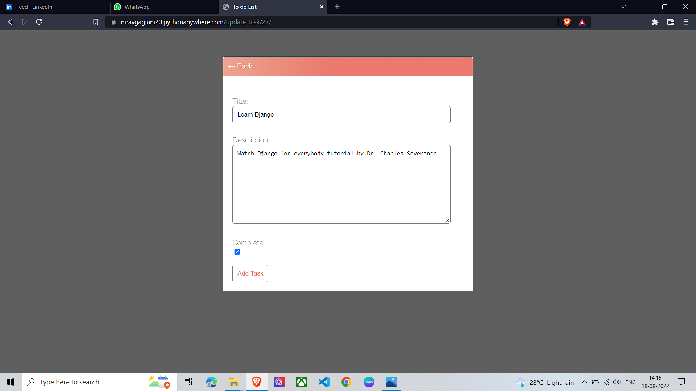
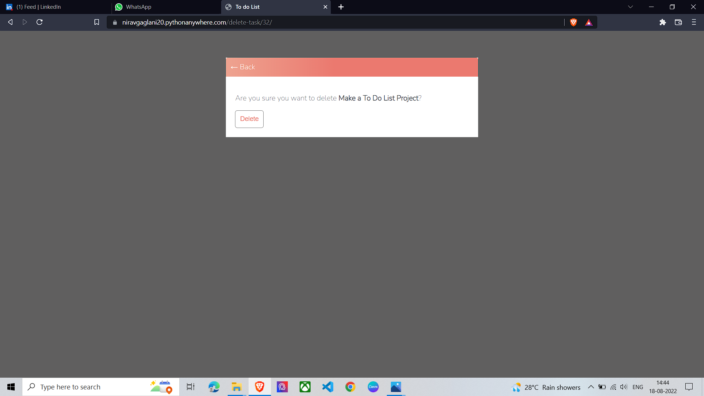

# To-Do-List-Django
## Installation Guide:
Download code from Repository
1. Install virtualenv:

`pip install virtualenv`

2. Create virtualenv:

`virtualenv name_of_virtualenv`

3. Activate virtualenv:

`.\name_of_virtualenv\Scripts\activate.ps1`

4. Install required modules:

`pip install -r requirements.txt`

5. Run project on LocalHost:

`python manage.py runserver`

## Project Features:
1. SignUp/Login to the website.

SignUp Page

Login Page

2. Create your own list of tasks.

3. Update your tasks.

4. Delete your tasks.

### Feel free to contribute by raising an issue or creating a pull request.
